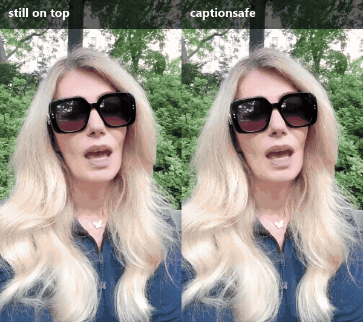

# captionsafe

Drop stills and b-roll into a captioned video **without covering the captions**.

Your video already has captions burned into the picture — CapCut, Submagic, Instagram, TikTok, whatever put them there. The moment you lay an image over the footage, those captions disappear under it. The usual workarounds are worse: cut the still into the timeline and the audio drifts out of sync, or re-caption the whole video by hand.

captionsafe keeps the captions. It cuts them out of the frames they were burned into and draws them back on top of your still.



Nothing is inserted into the timeline, so **length, audio and caption timing never change**.

## Install

```bash
npx github:burakeyler/captionsafe --help
```

Needs [ffmpeg](https://ffmpeg.org/download.html) on your PATH (`ffmpeg -version` should work) and Node 20+. The npm release (`npx captionsafe`) lands shortly; until then use the GitHub spec above.

## Use

```bash
npx github:burakeyler/captionsafe -i clip.mp4 -o out.mp4 \
  --insert 7.6,3.4,tears.jpg \
  --insert 98.5,4,burden.jpg
```

`--insert <start seconds>,<duration seconds>,<image>` — repeat it for as many stills as you like. Each still is scaled to fill the frame, cross-faded in and out, and the captions keep running over it.

```
  -i, --input <file>        source video (captions already burned in)
  -o, --output <file>       file to write
      --insert <t,dur,img>  still to show; repeat for several
      --band <y:height>     caption strip in pixels (default: lower third)
      --fade <seconds>      cross-fade on each still (default 0.35, 0 disables)
      --fill <pixels>       max letter size to fill (default: 75% of the band)
      --outline <r,g,b>     caption outline colour; "none" for captions without one
      --keep-temp           leave the extracted caption strips on disk
```

Every run prints what it found, so you can tell at a glance whether the cut-out worked:

```
caption strip: y=563 height=225
  still 1: 107 frames, outline rgb(110,81,243), 7.4% of the strip kept
```

A few percent is a healthy caption. Near 0% means the strip has no captions in it — fix `--band`. Above ~60% means the footage was mistaken for caption — pass `--outline`.

## How it works

1. **Read the caption strip.** For each still, the lower third of the original frames is read as raw pixels, for exactly the seconds the still is on screen.
2. **Find the outline colour.** Social captions are drawn with one saturated outline or highlight colour. It is found by histogramming only the saturated pixels that touch the near-neutral letter bodies — footage is saturated too, so proximity to the fill is what separates a caption from a sunset.
3. **Cut the caption out.** Outline pixels are kept; a near-neutral pixel is kept only when outline pixels enclose it on all four sides. That rejects skin, hair and sky, which are near-neutral but not enclosed.
4. **Reassemble.** ffmpeg lays the still over the video and the cut-out caption strip back over the still. Audio is copied, not re-encoded.

## Limits

- **Captions with no outline** (plain white text on footage) — pass `--outline none` and captionsafe keeps the near-neutral pixels of the strip. Expect a rougher edge where the footage is bright.
- **Captions that move around the frame** — set `--band` wide enough to contain them, or run one insert per position.
- **Karaoke highlighting** that recolours a word is kept as long as the highlight is the colour that was detected; otherwise pass `--outline`.
- Video is re-encoded once (libx264, CRF 20). Audio is stream-copied.

## Use it from Node

```js
import { insertStills } from "captionsafe";

await insertStills({
  input: "clip.mp4",
  output: "out.mp4",
  inserts: [{ at: 7.6, duration: 3.4, file: "tears.jpg" }],
});
```

## Contributing

Issues and PRs welcome — especially sample clips whose captions the detector gets wrong. `npm test` runs the unit tests (no ffmpeg needed).

MIT © Burak Eyler
